# AEGIS Learning Guide

## How To Use This Guide

This document is a technical reference for engineers and operators integrating AEGIS into local,
cloud, hybrid, and sidecar deployments.

AEGIS stands for Adaptive Edge Governance and Intelligence System. The project is concerned with a
simple but difficult question: how should a local edge controller decide whether a device, an event,
a command, or a fleet-wide action should be trusted enough to proceed?

AEGIS is implemented as a set of composable control-plane and edge-runtime modules. Devices and
gateways submit normalized envelopes, AEGIS validates identity and transport policy, applies replay
and security checks, updates local state, evaluates policy and safety gates, records audit evidence,
and optionally forwards accepted events to local or remote backends.

The guide focuses on integration surfaces, data contracts, runtime responsibilities, security
boundaries, and operational commands. It avoids deployment-specific assumptions so the same core can
run embedded as an SDK, as a standalone gateway, as a sidecar beside an existing backend, as a cloud
control-plane component, or as a local-only LAN controller.

## Table Of Contents

1. The problem AEGIS solves
2. The system at a glance
3. Repository and package map
4. Installing, building, and testing
5. Device identity and certificates
6. Trust scores and trust states
7. Protocol normalization
8. Local runtime and event priority
9. Policy evaluation
10. Actuation safety
11. Audit infrastructure
12. Health monitoring
13. Fleet analytics
14. Simulation and fault injection
15. Security hardening
16. Fleet API
17. CLI workflow
18. End-to-end system walk-through
19. Extension guide
20. Deployment and integration modes
21. Extension guide
22. Troubleshooting
23. Operational verification checklist

## 1. The Problem AEGIS Solves

Modern edge environments are no longer made of a few trusted machines in one room. They contain
sensors, actuators, gateways, unreliable links, intermittent cloud access, firmware versions,
operator commands, and devices that may be degraded, misconfigured, spoofed, or malicious.

In such an environment, a naive system usually fails in one of two ways. It either trusts every
message too easily, which creates safety and security risk, or it blocks too much, which makes the
fleet unusable. AEGIS tries to occupy the useful middle ground: it accepts that edge systems are
uncertain, then turns that uncertainty into explicit trust scores, states, policies, queues, and
auditable decisions.

AEGIS is especially useful when actuation matters. Reading a temperature value is one class of risk.
Opening a valve, rolling back firmware, or quarantining a device is another. The system therefore
distinguishes observation from permission. Seeing a device does not mean trusting it. Enrolling a
device does not mean it can perform every action. Passing one policy does not bypass the safety gate.

The key engineering principle is layered control. Every layer performs one job and hands a structured
result to the next layer.

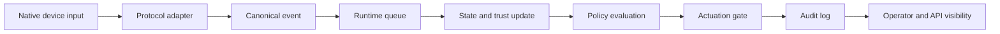

This diagram is the mental model for most of the repository. Whenever you are unsure where a feature
belongs, ask which box it naturally extends.

## 2. The System At A Glance

AEGIS is implemented as a TypeScript monorepo for Node 20 and newer. The choice matters because it
keeps the build, test, lint, and package interfaces consistent. Analytics are implemented in
TypeScript as well, so the repository can be built and tested with one toolchain.

The system has a small number of central data types. `DeviceIdentity` represents who a device is.
`CanonicalEvent` represents what the device or gateway reported. `TrustScore` represents the current
confidence model. `TrustState` represents the operational permission state. `Rule` represents policy
logic. `AuditRecord` represents evidence.

The following command gives you the fastest confirmation that the repository is healthy.

```bash
npm install
npm run build
npm run test
npm run lint
```

The expected result is a clean TypeScript build, all Vitest tests passing, and no lint or formatting
errors. When you are reviewing the project, run these commands before making changes. They establish a
known-good baseline.

## 3. Repository And Package Map

The package layout is intentionally modular. Each package owns a concern, and dependencies flow in a
controlled direction. This is important because edge governance systems become difficult to reason
about when transport code, policy code, trust code, and actuator code all know too much about each
other.

```text
packages/core        shared configuration, constants, and operator defaults
packages/trust       identity, certificates, trust score, and trust state machine
packages/protocol    adapters that normalize native messages into canonical events
packages/runtime     queues, event loop, state store, reconciliation, gates, audit, rollout
packages/policy      rule AST, parser, evaluator, conflict resolution, templates
packages/health      CUSUM, EWMA, and composite drift scoring
packages/analytics   causality, anomaly scoring, and survival estimation
packages/simulation  network impairment, fault injection, and twin fidelity
packages/security    signatures, audit signing, and STRIDE control mapping
packages/api         authenticated fleet dashboard API
packages/cli         local command-line harness
tests/integration    cross-package scenarios
docs                 supporting reference material
```

The dependency direction is not just an aesthetic choice. It prevents accidental privilege leaks. For
example, a protocol adapter should normalize input, but it should not call actuation APIs directly.
An API route may request a quarantine action, but the runtime and trust layers should still own the
state transition rules.

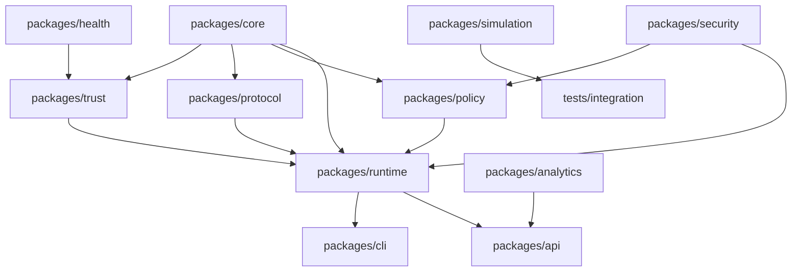

When you add a feature, try to preserve this structure. If a low-level package starts importing a
high-level package, pause and reconsider the design.

## 4. Installing, Building, And Testing

AEGIS uses standard Node workspace commands. You should run all commands from the repository root.

```bash
npm install
```

This installs the workspace dependencies. The project uses TypeScript, Vitest, ESLint, and Prettier.
There are no external rule engines or machine learning frameworks in the core implementation.

```bash
npm run build
```

This compiles the repository with the build TypeScript configuration. Build errors usually reveal
type drift, missing exports, incorrect optional property handling, or circular design mistakes.

```bash
npm run test
```

This runs the full Vitest suite. The tests are not ornamental; they are the executable definition of
the trust transitions, queue behavior, policy decisions, analytics formulas, and API authentication
requirements.

```bash
npm run lint
```

This runs ESLint and checks formatting with Prettier. Treat lint as part of the build gate. A
professional repository should not require readers to mentally ignore formatting noise.

```bash
npm run format
```

This formats the repository. Use it after broad documentation or style edits.

## 5. Device Identity And Certificates

The first technical question in an edge fleet is identity. AEGIS does not treat a device id string as
proof. A real device identity contains cryptographic material, a certificate, declared capabilities,
an authorization scope, and an enrollment timestamp.

In the repository, this logic lives in `packages/trust`. The identity module generates Ed25519 key
pairs and development self-signed certificates. The certificate support is intentionally lightweight
and suitable for local fleets, tests, and development environments. Production deployments can place
an HSM, TPM, or stronger certificate authority behind the same conceptual boundary.

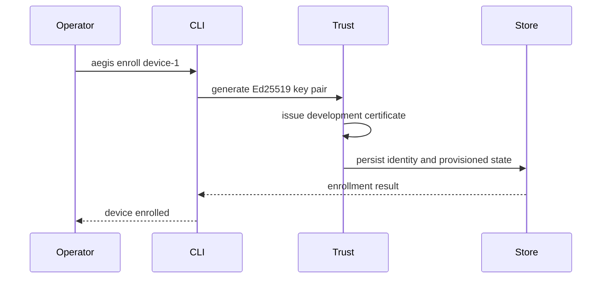

After building the project, you can run the enrollment flow with the compiled CLI.

```bash
node dist/packages/cli/src/index.js enroll device-1
node dist/packages/cli/src/index.js status device-1
```

Enrollment is not the same as full trust. Enrollment says the system knows the device and has
identity material. Later evidence determines whether the device reaches a stronger operational
state.

Certificate rotation is also part of identity management. AEGIS can decide to rotate a certificate
when it is too old, when trust falls below a configured threshold, or when an operator forces
rotation. This matters because long-lived credentials in edge environments are a common operational
risk.

## 6. Trust Scores And Trust States

Trust in AEGIS is not a boolean. A device is not simply trusted or untrusted. Instead, trust is a
weighted model with seven dimensions: identity, attestation, behavioral history, sensor integrity,
connectivity, policy compliance, and runtime health.

The composite trust score is calculated as a weighted sum.

```text
T(d,t) = sum(w_i * phi_i(d,t))
```

Here, `w_i` is the configured weight for a trust dimension, and `phi_i` is the dimension value for a
device at time `t`. The weights must sum to exactly 1.0. This invariant prevents silent scoring
mistakes where the composite score becomes inflated or deflated by configuration error.

Trust also changes over time. A score should not remain strong forever just because the device was
healthy yesterday. AEGIS applies exponential decay.

```text
T(d,t) = T(d,t0) * exp(-lambda * delta_t)
```

Evidence updates use a Bayesian beta model. Positive evidence increments alpha. Negative evidence
increments beta. The posterior mean is:

```text
alpha / (alpha + beta)
```

The trust score feeds a state machine. The state machine is where a numerical score becomes an
operational permission model.

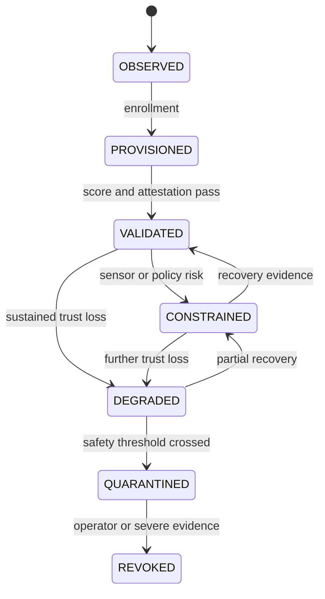

This state machine protects the rest of the system from vague trust decisions. A policy or actuation
gate can ask for permitted actions based on state, and the answer is deterministic.

## 7. Protocol Normalization

Edge fleets rarely speak one protocol. A gateway may receive MQTT messages, HTTP webhook events,
serial lines, WebSocket telemetry, and simulated BLE readings. If every runtime component had to
understand every native message format, the system would become brittle.

AEGIS solves this with protocol adapters. Every adapter has three jobs: decode the native payload,
validate the decoded object, and normalize it into a `CanonicalEvent`.

```text
native payload -> decode -> validate -> field map -> CanonicalEvent
```

The canonical event shape is simple and stable.

```ts
interface CanonicalEvent {
  readonly deviceId: string;
  readonly timestamp: string;
  readonly payload: Record<string, unknown>;
  readonly sourceProtocol: string;
  readonly sequenceId: string | number;
}
```

The MQTT adapter maps QoS values into reliability levels. The HTTP webhook adapter handles signed
JSON webhook-style events. The raw serial adapter handles line-delimited JSON. The WebSocket and BLE
adapters normalize gateway-style telemetry added from the reference inclusion review.

Reliability is modeled as a lattice.

```text
AT_MOST_ONCE <= AT_LEAST_ONCE <= EXACTLY_ONCE
```

When a chain of stages is composed, AEGIS returns the meet, meaning the weakest reliability guarantee
in the path. This is the correct conservative interpretation. A pipeline cannot honestly claim
exactly-once delivery if one stage only offers at-most-once delivery.

## 8. Local Runtime And Event Priority

The runtime is responsible for local behavior during normal operation and during network partitions.
Edge systems cannot assume a cloud service is always reachable. A local runtime must buffer events,
prioritize safety, update state, and shut down gracefully.

AEGIS uses a bounded offline queue. The queue supports several overflow strategies: drop oldest,
drop lowest priority, block producer, and reject new. The correct strategy depends on deployment
needs. A safety-critical deployment may prefer rejecting new low-value work rather than dropping a
safety alert.

Priority ordering is explicit.

```text
SAFETY_ALERT
ACTUATION_REQUEST
TRUST_UPDATE
SENSOR_EVENT
TELEMETRY
HOUSEKEEPING
```

The event loop consumes higher-priority work before lower-priority work. During graceful shutdown it
drains safety alerts and actuation requests before exit.

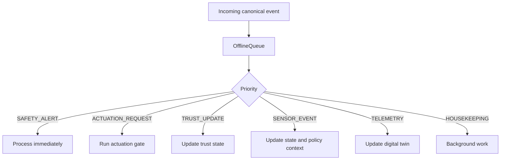

The runtime also includes an event bus. The event bus provides local publish/subscribe behavior with
a bounded recent-event log. A subscriber failure is isolated so that one bad handler does not prevent
other handlers from receiving an event. This is useful for telemetry fanout, audit side effects, and
dashboard feeds.

## 9. State Store, Discovery, And Digital Twin

AEGIS separates observed state from trusted permission. The in-process state store provides typed
getters and setters for runtime state. It is deliberately simple so tests can reason about behavior
without a database.

The device discovery registry handles a different problem: how should the system remember that it
has observed a device on a transport? Discovery records device id, protocols, capabilities, metadata,
first-seen time, and last-seen time. Discovery is useful, but it is not authorization. A discovered
device is not automatically trusted to actuate.

The digital twin manager stores the latest capability state for each device and a bounded telemetry
history. This is useful when an operator asks, "What is the latest known temperature for device-7?"
or when analytics need recent signal history.

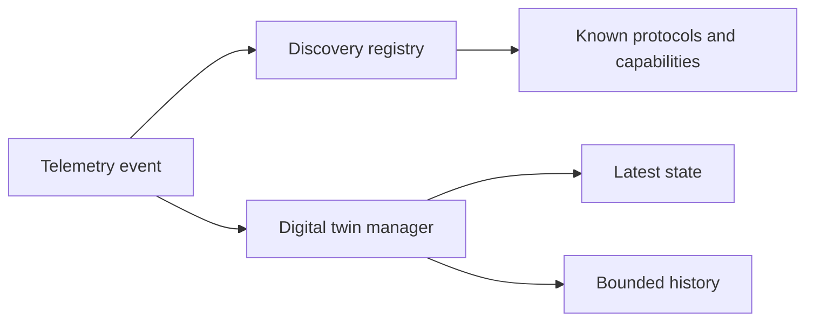

This design keeps the concepts clean. Discovery answers "what have we seen?" The digital twin
answers "what do we currently believe the device state is?" Trust answers "what is the device
allowed to do?"

## 10. Policy Evaluation

The policy engine lets operators express governance rules over state and events. AEGIS uses a typed
rule AST with condition variants such as atoms, NOT, AND, OR, WITHIN, COUNT, CONFIDENCE, and TRUST.

A simplified Rete-style evaluator processes the rules. In a full production Rete network, alpha
nodes test single conditions and beta nodes join partial matches. AEGIS implements the simplified
version needed by this system while avoiding an external rule-engine dependency.

Conflict resolution is safety-oriented. The action lattice is:

```text
BLOCK <= DEGRADE <= ADVISORY <= EXECUTE
```

The lower action is safer. If one rule says execute and another says block, block wins. This is not a
matter of convenience; it is a core safety invariant.

Here is a small policy file that blocks low-trust execution.

```json
{
  "id": "trust-block",
  "when": { "type": "TRUST", "op": "<", "value": 0.75 },
  "then": { "kind": "BLOCK" }
}
```

After saving it as `rule.json`, you can dry-run it with a state snapshot.

```bash
node dist/packages/cli/src/index.js policy check rule.json "{\"trust\":0.2}"
```

Policy signing is supported through the security package. In strict environments, unsigned policy
rules are rejected.

## 11. Actuation Safety

Actuation is the point where software decisions affect the physical or operational world. AEGIS
therefore requires a command to pass multiple gates before approval.

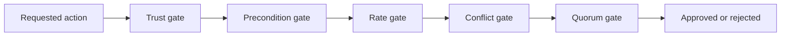

The trust gate verifies that the device has enough confidence. The precondition gate checks required
state. The rate gate enforces cooldown. The conflict gate prevents incompatible actions. The quorum
gate requires enough approvals for critical actions.

Critical quorum follows:

```text
q > (n + f) / 2
```

Here, `q` is approvals, `n` is total participants, and `f` is tolerated faulty participants. In code,
the threshold is implemented conservatively as a minimum integer approval count.

For continuous-valued physical commands, AEGIS also includes Control Barrier Function safety. A
safety envelope defines a safe set `h(x) >= 0`. A command must satisfy the discrete barrier
condition, or the system computes a projected safe command when possible.

Rollback is modeled explicitly. Fully reversible actions can issue inverse actions. Partially
reversible actions can issue limited recovery behavior. Irreversible actions escalate instead of
pretending rollback succeeded.

## 12. Audit Infrastructure

Auditability is not an afterthought. AEGIS records actuation decisions, policy evaluations, trust
updates, and state transitions in an append-only Merkle-style chain.

Each block stores an index, data, timestamp, previous hash, and current SHA-256 hash. Verification
walks the chain and returns the first tampered block index, or null when the chain is valid.

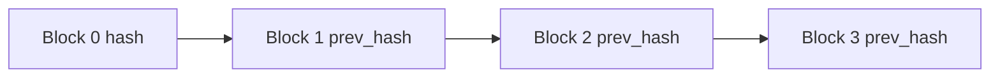

The append-only API design is important. If public code exposed update or delete methods for audit
blocks, the integrity model would become much weaker. Additional audit signing can be applied through
the security package so that blocks carry operator-key signatures as well as hashes.

## 13. Health Monitoring

Health monitoring detects when sensors or devices start behaving differently from baseline. AEGIS
implements CUSUM, EWMA, and composite drift scoring.

CUSUM is good for persistent shifts. It maintains upper and lower cumulative statistics and fires an
alert when either crosses its configured threshold.

```text
S+ = max(0, S+ + x - mu0 - k*sigma0)
S- = max(0, S- + mu0 - x - k*sigma0)
```

EWMA is good for gradual drift. It updates a smoothed value.

```text
z_n = lambda*x_n + (1-lambda)*z_(n-1)
```

Composite drift aggregates normalized deviations across sensors.

```text
D(d,t) = 1 - exp(-sum(alpha_j * Delta_j(t)))
```

The sensor integrity trust dimension can be set to `1 - D(d,t)`. This creates a feedback path from
statistical health into the trust model. A drifting sensor can therefore cause a device to become
constrained or degraded even if its identity remains valid.

## 14. Fleet Analytics

Fleet analytics answer questions that cannot be answered by looking at one event. Does one device's
time series help predict another device's behavior? Which devices look anomalous compared with the
fleet? Is a new firmware version surviving as well as the old version?

Granger causality compares restricted and unrestricted regressions. If lagged values of series X
improve prediction of series Y, AEGIS can add a directed edge in a causality graph.

Isolation Forest detects anomalous feature vectors. Each random tree isolates points by selecting a
random feature and split. Anomalies tend to have shorter path lengths because they are easier to
separate from normal clusters.

Kaplan-Meier survival analysis estimates survival over time while handling right-censored
observations. This is important for firmware rollout because not every device will have failed or
completed observation by the time a decision is needed.

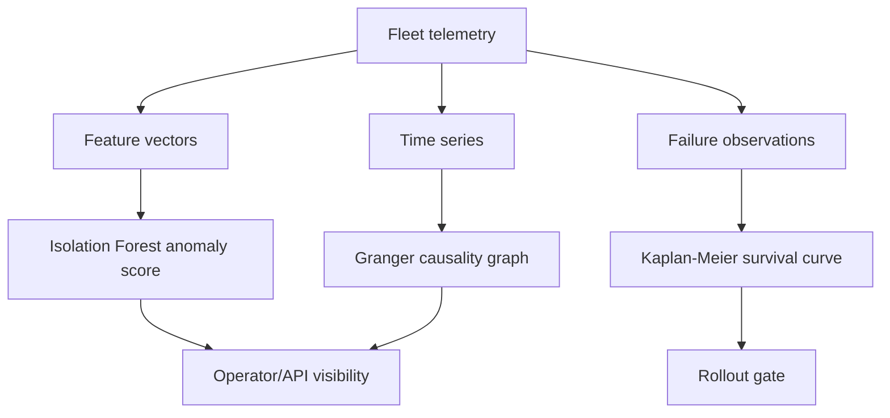

The formulas behind these modules are documented in `docs/math-reference.md`.

## 15. Simulation And Fault Injection

Simulation is how AEGIS tests dangerous or rare scenarios without needing a real fleet to fail. The
simulation package includes a Gilbert-Elliott network channel, a fault injector, and a twin fidelity
metric.

The Gilbert-Elliott model has GOOD and BAD states. It is useful for bursty packet loss because real
networks often lose packets in clusters rather than independently.

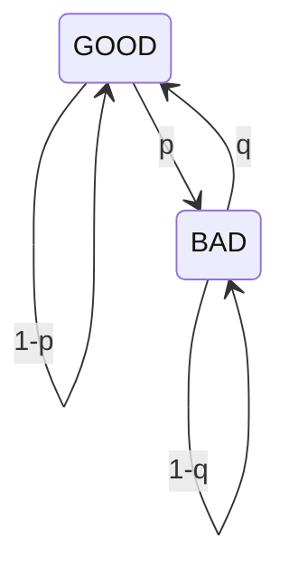

Fault injection uses fault, error, and failure categories. A fault might corrupt a sensor reading. An
error might drop an acknowledgement. A failure might make a device unresponsive for a bounded time.
These injections are automatically restored after their configured window.

Twin fidelity compares a digital twin with real observations over a sliding window. A perfect twin
has fidelity 1.0. Lower fidelity reveals that the twin no longer represents the real device well.

## 16. Security Hardening

AEGIS includes several security controls that reinforce each other. Device identity uses Ed25519
keys. Commands use replay prevention with monotone sequence numbers, timestamp skew checks, nonce
deduplication, and signature verification. Policies can be signed. Audit blocks can be signed.
Dashboard API requests require signed operator tokens.

The STRIDE model is used to organize hardening work. STRIDE stands for Spoofing, Tampering,
Repudiation, Information Disclosure, Denial of Service, and Elevation of Privilege. Mapping controls
against these categories helps prevent security work from becoming informal or incomplete.

The most important practical rule is this: adapters normalize input, but they do not get authority
to actuate. This protects the system from a common gateway mistake where receiving a valid-looking
message accidentally becomes permission to perform a command.

## 17. Fleet API

The API package provides a dependency-free REST-style interface for tests and embedding. It accepts
typed request objects and returns typed responses. Every endpoint requires a signed operator token.
Write endpoints are rate limited.

The API can list devices, show device detail, return audit records, return telemetry history, return
recent logs, return fleet health, return anomaly lists, return causality graphs, return firmware
survival curves, quarantine a device, and trigger rollback.

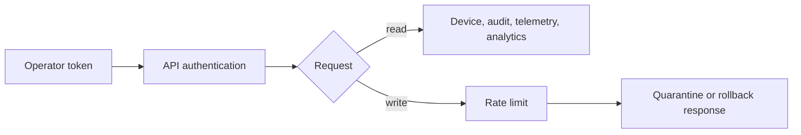

Do not add unauthenticated endpoints. Even a read endpoint can leak sensitive fleet topology,
firmware, or operational state.

## 18. CLI Workflow

The CLI is the easiest way to run AEGIS locally. Build first, then call the compiled CLI.

```bash
npm run build
node dist/packages/cli/src/index.js enroll device-1
node dist/packages/cli/src/index.js status device-1
node dist/packages/cli/src/index.js simulate-event device-1 "{\"payload\":{\"temperature\":21}}"
node dist/packages/cli/src/index.js audit device-1 --last 5
```

The CLI flow is intentionally small. It is not a distributed production control plane. It is a local
operator harness that proves the identity, state, event, policy, and audit paths are usable from a
terminal.

## 19. End-To-End Walk-Through

Now combine the major pieces. A device is enrolled and receives identity material. It emits a native
message over MQTT, HTTP, serial, WebSocket, or BLE. A protocol adapter converts that message to a
canonical event. The runtime queue orders it by priority. State and trust are updated. Policies run
over the current working memory. If a command is requested, the actuation gate checks trust,
preconditions, rate limits, conflicts, and quorum. The audit log records the decision. Analytics and
API views make the result visible.

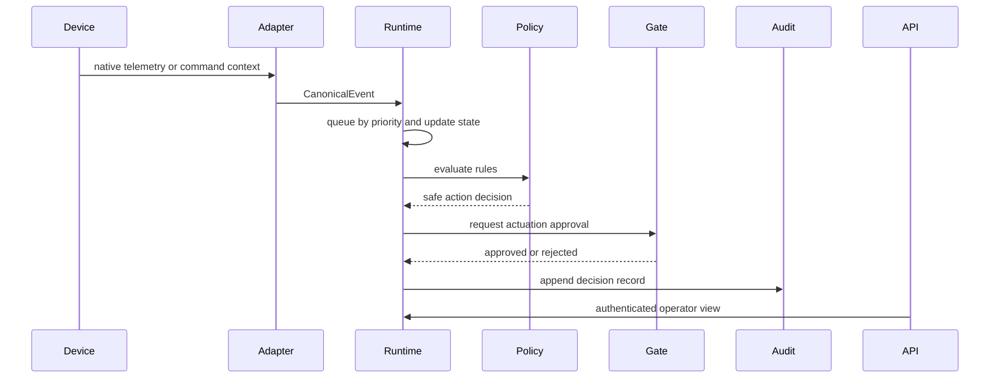

This flow is the heart of AEGIS. When you debug a problem, locate the failing handoff. Is the native
payload malformed? Did field mapping fail? Did the queue order the event correctly? Did the policy
fire? Did the actuation gate reject the command? Did audit verification fail? This methodical
approach is much faster than searching randomly through the codebase.

## 20. Deployment And Integration Modes

AEGIS can run in several integration modes without changing the trust, policy, or audit core.

`SDK_EMBEDDED` mode is used when another Node service imports AEGIS packages directly and calls the
gateway or runtime APIs in-process. This is the tightest integration model and is useful when an
existing backend wants AEGIS features without starting a separate process.

`STANDALONE_PROCESS` mode is used when AEGIS owns ingress, registration, gateway APIs, local state,
and backend fanout. This mode fits a Raspberry Pi gateway between local nodes and cloud services.

`SIDECAR_PROCESS` mode is used when AEGIS runs beside an existing backend. The backend can send
traffic to AEGIS for validation, policy checks, registration, or audit while continuing to own its
business database and user interface.

`CLOUD_CONTROL_PLANE` mode is used when AEGIS runs in the cloud and receives telemetry or commands
from field gateways. This mode is appropriate when multiple sites report to a central fleet service.

`LOCAL_LAN_ONLY` mode is used when no cloud dependency is allowed. Devices communicate over LAN,
serial bus, LoRa gateway, MQTT broker, HTTP, BLE bridge, ESP-NOW bridge, or broadcast UDP, and AEGIS
keeps decisions local.

`MULTI_LAN_BRIDGE` mode is used when two or more local networks exchange device state through
controlled gateway links. AEGIS treats each LAN, serial bus, cloud endpoint, or mesh as a network
segment with explicit peer-forwarding and cloud-egress permissions.

The gateway package exposes a universal ingress envelope. That envelope can be produced by direct
HTTP ingestion, MQTT bridge code, a LoRa concentrator, an RS485 parser, an ESP-NOW bridge, a BLE
bridge, or another service calling AEGIS as a validation API.

```ts
interface UniversalIngressEnvelope {
  readonly deviceId: string;
  readonly transport: EdgeTransport;
  readonly eventKind: IngressEventKind;
  readonly timestamp: string;
  readonly sequenceId: string | number;
  readonly payload: unknown;
  readonly security: IngressSecurityDescriptor;
}
```

For multiplexed channels such as RS485, a channel parser can split a single physical stream into
multiple device envelopes as long as every frame carries device identity or a verifiable identity
reference.

```text
RS485 frame stream
  -> channel parser
  -> per-device UniversalIngressEnvelope
  -> security and replay checks
  -> state, policy, audit, backend fanout
```

Backend integration is intentionally pluggable. AEGIS can forward accepted canonical events to a
local store, an HTTP endpoint, a Kafka-compatible producer, a cloud service, or a custom enterprise
connector. Coordination hooks are also exposed for ZooKeeper, etcd, or Consul-style gateway
membership registries without adding those systems as hard dependencies.

First-time device registration can be local or delegated. In local registration, AEGIS validates a
device id and optional password, issues Ed25519 identity material, creates a certificate, and stores
gateway credentials. In delegated registration, an external service authenticates the device or user
and asks AEGIS to mint identity material and gateway policy. In federated registration, an external
authority approves capabilities and scope while AEGIS remains responsible for local credential and
certificate issuance.

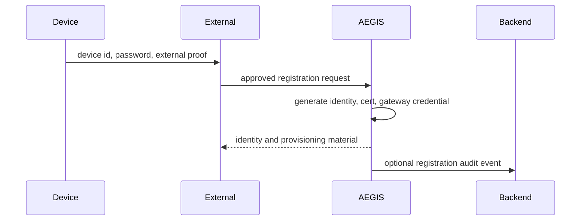

Automatic network baselining is used when operators have not supplied explicit thresholds. AEGIS
learns latency, packet loss, and reconnect behavior per segment or channel and flags deviations when
new observations move outside learned normal conditions. This is designed for standalone and sidecar
modes where the external service may not have a complete network model.

Verified attack attempts can be recorded through the gateway API. AEGIS stores attack class,
indicators, counts, and last-seen metadata. Future rejections can be classified using both built-in
reason mapping and learned indicators, allowing the gateway to become more useful as verified
malicious attempts are reviewed.

## 21. Extension Guide

To add a new protocol, create a new adapter, define its reliability and security level, implement
decode and validation functions, map fields to `CanonicalEvent`, export the adapter, and add tests
for valid and invalid payloads.

To add a new policy, represent it with the existing AST, test parser behavior, test evaluator
behavior, test conflict resolution, and sign the rule when strict mode is enabled.

To add a new safety gate, keep it independently testable. Return clear rejection reasons. Make
thresholds configurable. Audit important decisions. Never hide safety behavior in transport code.

To add a new analytics function, start from the mathematical definition. Name constants. Use
deterministic test data. Document the formula in `docs/math-reference.md`. Avoid introducing large
frameworks when a small auditable implementation is sufficient.

To add persistent storage, introduce it behind an interface. Do not scatter database calls across
trust, policy, protocol, and runtime modules. The current in-memory components are simple by design;
they make the boundaries visible.

## 22. Troubleshooting

If TypeScript fails, read the first error before changing code. Many failures come from exact
optional property types, missing exports, or an import crossing the wrong package boundary.

If tests fail in protocol code, inspect the field map and canonical event shape. If tests fail in
runtime code, inspect priority ordering and gate results. If tests fail in policy code, inspect the
AST and conflict resolution result. If tests fail in analytics code, inspect floating point
tolerances and deterministic seeds.

If API authentication tests fail, check token signing, public key selection, and the Authorization
header format.

If audit verification fails, check whether the hash input changed. Audit hash functions are
intentionally sensitive to data, timestamp, index, and previous hash.

The most useful debugging command sequence is:

```bash
git status --short
npm run build
npm run test
npm run lint
```

Run it before and after changes. It tells you whether the repository moved from a known-good state to
a failing state.

## 23. Operational Verification Checklist

Before deploying AEGIS as a gateway, SDK, sidecar, or cloud service, verify the following checks.

Ingress paths must reject malformed envelopes, oversized bodies, unauthorized transports, replayed
sequence numbers, duplicate nonces, invalid signatures, and plaintext commands.

Registration paths must define the authority model, password or external proof requirements,
capability scope, certificate issuance behavior, and credential delivery channel.

Multi-channel deployments must define segment ids, channel ids, maximum frame size, frame format,
device identity requirements, and whether peer forwarding or cloud egress is allowed.

Backend fanout must define local-only behavior, remote delivery retries, queue size monitoring, and
failure visibility.

Operator APIs must require authentication except for intentionally exposed device ingress endpoints
that perform their own envelope-level security validation.

Audit and gateway logs must be retained long enough to reconstruct accepted ingress, rejected
ingress, registration decisions, baseline deviations, backend delivery, and learned attack patterns.

Baseline learning must be enabled only for metrics that are expected to be stationary enough for
statistical comparison. Explicit operator thresholds should override learned baselines for
safety-critical traffic.

## 24. Closing Model

AEGIS is a layered governance system. Identity answers who the device is. Protocol normalization
answers what was reported. Runtime ordering answers what should be processed first. Trust scoring
answers how much confidence the system has. Policy evaluation answers what the rules say. Actuation
safety answers whether a command is allowed to affect the world. Audit answers what happened and why.
Analytics answer what patterns are emerging across time and fleet behavior.

If you preserve these separations, the system remains understandable. If you blur them, the system
becomes hard to test and unsafe to operate.

That is the main lesson of AEGIS: trusted edge orchestration is not one clever algorithm. It is a
carefully connected set of small, testable decisions.
